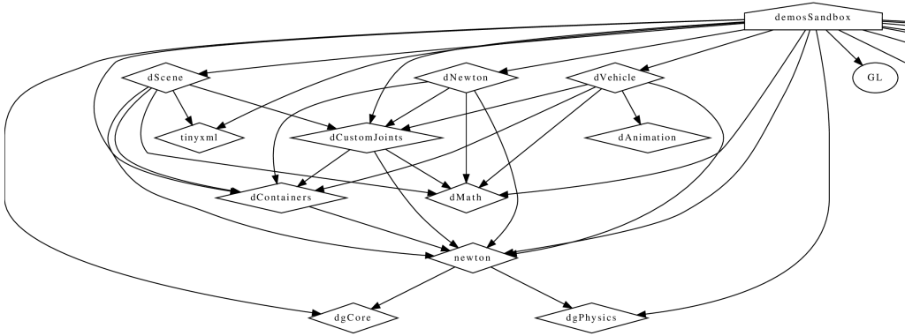

# CMake Scripts <!-- omit in toc -->

[](https://git.stabletec.com/other/cmake-scripts/commits/main)
[](https://git.stabletec.com/other/cmake-scripts/blob/main/LICENSE)

This is a collection of quite useful scripts that expand the possibilities for building software with CMake, by making some things easier and otherwise adding new build types

- [C++ Standards `c++-standards.cmake`](#c-standards-c-standardscmake)
- [Sanitizer Builds `sanitizers.cmake`](#sanitizer-builds-sanitizerscmake)
- [Code Coverage `code-coverage.cmake`](#code-coverage-code-coveragecmake)
  - [Added Targets](#added-targets)
  - [Usage](#usage)
    - [Example 1 - All targets instrumented](#example-1---all-targets-instrumented)
      - [1a - Via global command](#1a---via-global-command)
      - [1b - Via target commands](#1b---via-target-commands)
    - [Example 2: Target instrumented, but with regex pattern of files to be excluded from report](#example-2-target-instrumented-but-with-regex-pattern-of-files-to-be-excluded-from-report)
    - [Example 3: Target added to the 'ccov' and 'ccov-all' targets](#example-3-target-added-to-the-ccov-and-ccov-all-targets)
- [AFL Fuzzing Instrumentation `afl-fuzzing.cmake`](#afl-fuzzing-instrumentation-afl-fuzzingcmake)
  - [Usage](#usage-1)
- [Compiler Options `compiler-options.cmake`](#compiler-options-compiler-optionscmake)
- [Dependency Graph `dependency-graph.cmake`](#dependency-graph-dependency-graphcmake)
  - [Required Arguments](#required-arguments)
    - [OUTPUT\_TYPE *STR*](#output_type-str)
  - [Optional Arguments](#optional-arguments)
    - [ADD\_TO\_DEP\_GRAPH](#add_to_dep_graph)
    - [TARGET\_NAME *STR*](#target_name-str)
    - [OUTPUT\_DIR *STR*](#output_dir-str)
- [GLSL Shader File Targeted Compilation`glsl-shaders.cmake`](#glsl-shader-file-targeted-compilationglsl-shaderscmake)
  - [Example](#example)
  - [Required Arguments](#required-arguments-1)
    - [TARGET\_NAME](#target_name)
  - [Optional Arguments](#optional-arguments-1)
    - [INTERFACE *FILES*](#interface-files)
    - [PUBLIC *FILES*](#public-files)
    - [PRIVATE *FILES*](#private-files)
    - [COMPILE\_OPTIONS *OPTIONS*](#compile_options-options)
- [Doxygen `doxygen.cmake`](#doxygen-doxygencmake)
  - [Optional Arguments](#optional-arguments-2)
    - [ADD\_TO\_DOC](#add_to_doc)
    - [INSTALLABLE](#installable)
    - [PROCESS\_DOXYFILE](#process_doxyfile)
    - [TARGET\_NAME *STR*](#target_name-str-1)
    - [OUTPUT\_DIR *STR*](#output_dir-str-1)
    - [INSTALL\_PATH *STR*](#install_path-str)
    - [DOXYFILE\_PATH *STR*](#doxyfile_path-str)
- [Prepare the Catch Test Framework `prepare-catch.cmake`](#prepare-the-catch-test-framework-prepare-catchcmake)
  - [Optional Arguments](#optional-arguments-3)
    - [COMPILED\_CATCH](#compiled_catch)
    - [CATCH1](#catch1)
    - [CLONE](#clone)
- [Tools `tools.cmake`](#tools-toolscmake)
  - [clang-tidy](#clang-tidy)
  - [include-what-you-use](#include-what-you-use)
  - [cppcheck](#cppcheck)
- [Formatting `formatting.cmake`](#formatting-formattingcmake)
  - [clang-format](#clang-format)
  - [cmake-format](#cmake-format)
- [Link Time Optimization / Interprocedural Optimization `link-time-optimization.cmake`](#link-time-optimization--interprocedural-optimization-link-time-optimizationcmake)
  - [Optional Arguments](#optional-arguments-4)
    - [REQUIRED](#required)

## C++ Standards [`c++-standards.cmake`](c++-standards.cmake)

Using the functions `cxx_11()`, `cxx_14()`, `cxx_17()` or `cxx_20()` this adds the appropriate flags for both unix and MSVC compilers, even for those before 3.11 with improper support.

These obviously force the standard to be required, and also disables compiler-specific extensions, ie `--std=gnu++11`. This helps to prevent fragmenting the code base with items not available elsewhere, adhering to the agreed C++ standards only.

## Sanitizer Builds [`sanitizers.cmake`](sanitizers.cmake)

Sanitizers are tools that perform checks during a program’s runtime and returns issues, and as such, along with unit testing, code coverage and static analysis, is another tool to add to the programmers toolbox. And of course, like the previous tools, are tragically simple to add into any project using CMake, allowing any project and developer to quickly and easily use.

A quick rundown of the tools available, and what they do:
- [LeakSanitizer](https://clang.llvm.org/docs/LeakSanitizer.html) detects memory leaks, or issues where memory is allocated and never deallocated, causing programs to slowly consume more and more memory, eventually leading to a crash.
- [AddressSanitizer](https://clang.llvm.org/docs/AddressSanitizer.html) is a fast memory error detector. It is useful for detecting most issues dealing with memory, such as:
    - Out of bounds accesses to heap, stack, global
    - Use after free
    - Use after return
    - Use after scope
    - Double-free, invalid free
    - Memory leaks (using LeakSanitizer)
- [ThreadSanitizer](https://clang.llvm.org/docs/ThreadSanitizer.html) detects data races for multi-threaded code.
- [UndefinedBehaviourSanitizer](https://clang.llvm.org/docs/UndefinedBehaviorSanitizer.html) detects the use of various features of C/C++ that are explicitly listed as resulting in undefined behaviour. Most notably:
    - Using misaligned or null pointer.
    - Signed integer overflow
    - Conversion to, from, or between floating-point types which would overflow the destination
    - Division by zero
    - Unreachable code
- [MemorySanitizer](https://clang.llvm.org/docs/MemorySanitizer.html) detects uninitialized reads.
- [Control Flow Integrity](https://clang.llvm.org/docs/ControlFlowIntegrity.html) is designed to detect certain forms of undefined behaviour that can potentially allow attackers to subvert the program's control flow.

These are used by declaring the `USE_SANITIZER` CMake variable as string containing any of:
- Address
- Memory
- MemoryWithOrigins
- Undefined
- Thread
- Leak
- CFI

Multiple values are allowed, e.g. `-DUSE_SANITIZER=Address,Leak` but some sanitizers cannot be combined together, e.g.`-DUSE_SANITIZER=Address,Memory` will result in configuration error. The delimeter character is not required and `-DUSE_SANITIZER=AddressLeak` would work as well.

## Code Coverage [`code-coverage.cmake`](code-coverage.cmake)


> In computer science, test coverage is a measure used to describe the degree to which the source code of a program is executed when a particular test suite runs. A program with high test coverage, measured as a percentage, has had more of its source code executed during testing, which suggests it has a lower chance of containing undetected software bugs compared to a program with low test coverage. Many different metrics can be used to calculate test coverage; some of the most basic are the percentage of program subroutines and the percentage of program statements called during execution of the test suite. 
>
> [Wikipedia, Code Coverage](https://en.wikipedia.org/wiki/Code_coverage)

Code coverage is the detailing of, during the execution of a binary, which regions, functions, or lines of code are *actually* executed. This can be used in a number of ways, from figuring out areas that automated testing is lacking or not touching, to giving a user an instrumented binary to determine which areas of code are used most/least to determine which areas to focus on. Although this does come with the caveat that coverage is no guarantee of good testing, just of what code has been.

Coverage here is supported on both GCC and Clang. GCC requires the `lcov` program, and Clang requires `llvm-cov` and `llvm-profdata`, often provided with the llvm toolchain.

To enable, turn on the `CODE_COVERAGE` variable.

### Added Targets

- GCOV/LCOV:
    - ccov : Generates HTML code coverage report for every target added with 'AUTO' parameter.
    - ccov-${TARGET_NAME} : Generates HTML code coverage report for the associated named target.
    - ccov-all : Generates HTML code coverage report, merging every target added with 'ALL' parameter into a single detailed report.
    - ccov-all-capture : Generates an all-merged.info file, for use with coverage dashboards (e.g. codecov.io, coveralls).
- LLVM-COV:
    - ccov : Generates HTML code coverage report for every target added with 'AUTO' parameter.
    - ccov-report : Generates HTML code coverage report for every target added with 'AUTO' parameter.
    - ccov-${TARGET_NAME} : Generates HTML code coverage report.
    - ccov-rpt-${TARGET_NAME} : Prints to command line summary per-file coverage information.
    - ccov-show-${TARGET_NAME} : Prints to command line detailed per-line coverage information.
    - ccov-all : Generates HTML code coverage report, merging every target added with 'ALL' parameter into a single detailed report.
    - ccov-all-report : Prints summary per-file coverage information for every target added with ALL' parameter to the command line.

### Usage

To enable any code coverage instrumentation/targets, the single CMake option of `CODE_COVERAGE` needs to be set to 'ON', either by GUI, ccmake, or on the command line ie `-DCODE_COVERAGE=ON`.

From this point, there are two primary methods for adding instrumentation to targets:
1. A blanket instrumentation by calling `add_code_coverage()`, where all targets in that directory and all subdirectories are automatically instrumented.
2. Per-target instrumentation by calling `target_code_coverage(<TARGET_NAME>)`, where the target is given and thus only that target is instrumented. This applies to both libraries and executables.

To add coverage targets, such as calling `make ccov` to generate the actual coverage information for perusal or consumption, call `target_code_coverage(<TARGET_NAME>)` on an *executable* target.

**NOTE:** For more options, please check the actual [`code-coverage.cmake`](code-coverage.cmake) file.

#### Example 1 - All targets instrumented

In this case, the coverage information reported will will be that of the `theLib` library target and `theExe` executable.

##### 1a - Via global command

```
add_code_coverage() # Adds instrumentation to all targets

add_library(theLib lib.cpp)

add_executable(theExe main.cpp)
target_link_libraries(theExe PRIVATE theLib)
target_code_coverage(theExe) # As an executable target, adds the 'ccov-theExe' target (instrumentation already added via global anyways) for generating code coverage reports.
```

##### 1b - Via target commands

```
add_library(theLib lib.cpp)
target_code_coverage(theLib) # As a library target, adds coverage instrumentation but no targets.

add_executable(theExe main.cpp)
target_link_libraries(theExe PRIVATE theLib)
target_code_coverage(theExe) # As an executable target, adds the 'ccov-theExe' target and instrumentation for generating code coverage reports.
```

#### Example 2: Target instrumented, but with regex pattern of files to be excluded from report

```
add_executable(theExe main.cpp non_covered.cpp)
target_code_coverage(theExe EXCLUDE non_covered.cpp) # As an executable target, the reports will exclude the non_covered.cpp file.
```

#### Example 3: Target added to the 'ccov' and 'ccov-all' targets

```
add_code_coverage_all_targets(EXCLUDE test/*) # Adds the 'ccov-all' target set and sets it to exclude all files in test/ folders.

add_executable(theExe main.cpp non_covered.cpp)
target_code_coverage(theExe AUTO ALL EXCLUDE non_covered.cpp test/*) # As an executable target, adds to the 'ccov' and ccov-all' targets, and the reports will exclude the non-covered.cpp file, and any files in a test/ folder.
```

## AFL Fuzzing Instrumentation [`afl-fuzzing.cmake`](afl-fuzzing.cmake)

> American fuzzy lop is a security-oriented fuzzer that employs a novel type of compile-time instrumentation and genetic algorithms to automatically discover clean, interesting test cases that trigger new internal states in the targeted binary. This substantially improves the functional coverage for the fuzzed code. The compact synthesized corpora produced by the tool are also useful for seeding other, more labor- or resource-intensive testing regimes down the road.
>
> [american fuzzy lop](https://lcamtuf.coredump.cx/afl/)

NOTE: This actually works based off the still-developed daughter project [AFL++](https://aflplus.plus/).

### Usage

To enable the use of AFL instrumentation, this file needs to be included into the CMake scripts at any point *before* any of the compilers are setup by CMake, typically at/before the first call to project(), or any part before compiler detection/validation occurs. This is since CMake does not support changing the compiler after it has been set:

```
cmake_minimum_required(VERSION 3.4)
include(cmake/afl-fuzzing.cmake)
project(Example C CXX)
```

Using `-DAFL=ON` will search for and switch to the AFL++ compiler wrappers that will instrument builds, or error if it cannot.

Using `-DAFL_MODE=<MODE>` will attempt to use the specified  instrumentation type, see [here](https://github.com/AFLplusplus/AFLplusplus/blob/stable/docs/fuzzing_in_depth.md). Options are:
- LTO
- LLVM
- GCC-PLUGIN
- CLANG
- GCC

Using `-DAFL_ENV_OPTIONS=<...;...>` allows adding any number of AFL++'s instrumentation enabled via environment variables, and these will be prefixed to the build calls (see `afl-cc -hh`).

As an example, a CMake configuration such as this:
```cmake .. -DAFL_MODE=LTO -DAFL_ENV_OPTIONS=AFL_LLVM_THREADSAFE_INST=1;AFL_LLVM_LAF_ALL=1```
would result in build commands such as this:
```AFL_LLVM_THREADSAFE_INST=1 AFL_LLVM_LAF_ALL=1 afl-clang-lto --afl-lto <...>```

## Compiler Options [`compiler-options.cmake`](compiler-options.cmake)

Allows for easy use of some pre-made compiler options for the major compilers.

Using `-DENABLE_ALL_WARNINGS=ON` will enable almost all of the warnings available for a compiler:

| Compiler | Options       |
| :------- | :------------ |
| MSVC     | /W4           |
| GCC      | -Wall -Wextra |
| Clang    | -Wall -Wextra |

Using `-DENABLE_EFFECTIVE_CXX=ON` adds the `-Weffc++` for both GCC and clang.

Using `-DGENERATE_DEPENDENCY_DATA=ON` generates `.d` files along with regular object files on a per-source file basis on GCC/Clang compilers. These files contains the list of all header files used during compilation of that compilation unit.

## Dependency Graph [`dependency-graph.cmake`](dependency-graph.cmake)

CMake, with the dot application available, will build a visual representation of the library/executable dependencies, like so:


### Required Arguments

#### OUTPUT_TYPE *STR*
The type of output of `dot` to produce. Can be whatever `dot` itself supports (eg. png, ps, pdf).

### Optional Arguments

#### ADD_TO_DEP_GRAPH
If specified, add this generated target to be a dependency of the more general `dep-graph` target.

#### TARGET_NAME *STR*
The name to give the doc target. (Default: doc-${PROJECT_NAME})

#### OUTPUT_DIR *STR*
The directory to place the generated output

## GLSL Shader File Targeted Compilation[`glsl-shaders.cmake`](glsl-shaders.cmake)

This function acts much like the 'target_sources' function, as in raw GLSL shader files can be passed in and will be compiled using 'glslangValidator', provided it is available, where the compiled files will be located where the sources files are but with the '.spv' suffix appended.

The first argument is the target that the files are associated with, and will be compiled as if it were a source file for it. All provided shaders are also only recompiled if the source shader file has been modified since the last compilation.

### Example
When calling `make vk_lib` the shaders will also be compiled with the library's `.c` files.

```
add_library(vk_lib lib.c, shader_manager.c)
target_glsl_shaders(vk_lib
    PRIVATE test.vert test.frag
    COMPILE_OPTIONS --target-env vulkan1.1)
```

### Required Arguments

#### TARGET_NAME
Name of the target the shader files are associated with and to be compiled for.

### Optional Arguments

#### INTERFACE *FILES*
 When the following shader files are added to a target, they are done so as 'INTERFACE' type files

#### PUBLIC *FILES*
When the following shader files are added to a target, they are done so as 'PUBLIC' type files

#### PRIVATE *FILES*
When the following shader files are added to a target, they are done so as 'PRIVATE' type files

#### COMPILE_OPTIONS *OPTIONS*
These are other options passed straight to the 'glslangValidator' call with the source shader file

## Doxygen [`doxygen.cmake`](doxygen.cmake)

Builds doxygen documentation with a default 'Doxyfile.in' or with a specified one, and can make the results installable (under the `doc` install target)

This can only be used once per project, as each target generated is as `doc-${PROJECT_NAME}` unless TARGET_NAME is specified.

### Optional Arguments

#### ADD_TO_DOC
If specified, adds this generated target to be a dependency of the more general `doc` target.

#### INSTALLABLE
Adds the generated documentation to the generic `install` target, under the `documentation` installation group.

#### PROCESS_DOXYFILE
If set, then will process the found Doxyfile through the CMAKE `configure_file` function for macro replacements before using it. (@ONLY)

#### TARGET_NAME *STR*
The name to give the doc target. (Default: doc-${PROJECT_NAME})

#### OUTPUT_DIR *STR*
The directory to place the generated output. (Default: ${CMAKE_CURRENT_BINARY_DIR}/doc)

#### INSTALL_PATH *STR*
The path to install the documenttation under. (if not specified, defaults to 'share/${PROJECT_NAME})

#### DOXYFILE_PATH *STR*
The given doxygen file to use/process. (Defaults to'${CMAKE_CURRENT_SOURCE_DIR}/Doxyfile')

## Prepare the Catch Test Framework [`prepare-catch.cmake`](prepare-catch.cmake)

**DEPRECATED**: Catch now has good CMake integration available natively, so this is no longer required and will be dropped in a future release.

The included `prepare_catch` function contained within attempts to add the infrastructure necessary for automatically adding C/C++ tests using the Catch2 library, including either an interface or pre-compiled 'catch' target library.

It first attempts to find the header on the local machine, and failing that, clones the single header variant for use. It does make the determination between pre-C++11 and will use Catch1.X rather than Catch2 (when cloned), automatically or forced.. Adds a subdirectory of tests/ if it exists from the macro's calling location.

### Optional Arguments

#### COMPILED_CATCH
If this option is specified, then generates the 'catch' target as a library with catch already pre-compiled as part of the library. Otherwise acts just an interface library for the header location.

#### CATCH1
Force the use of Catch1.X, rather than auto-detecting the C++ version in use.

#### CLONE
Force cloning of Catch, rather than attempting to use a locally-found variant.

## Tools [`tools.cmake`](tools.cmake)

The three tools in this are used via two provided functions each, for example for clang-tidy:
```
add_executable(big_test)

clang_tidy()

# Sources provided here are run with clang-tidy with no options
add_executable(test2 main2.cpp)
target_sources(big_test test2.c test2.cpp)

clang_tidy(-header-filter='${CMAKE_SOURCE_DIR}/*')

# Sources provided here are run with clang-tidy with the header-filter options provided to it from above
add_execuable(test1 main1.cpp)
target_sources(big_test test1.c test1.cpp)

reset_clang_tidy()

# Sources provided here are not run with clang-tidy at all
add_executable(test3 main3.cpp)
target_sources(big_test test3.c test3.cpp)

clang_tidy()

# Sources provided here are run with clang-tidy with no options
add_executable(test4 main4.cpp)
target_sources(big_test test4.c test4.cpp)
```

### clang-tidy

> clang-tidy is a clang-based C++ “linter” tool. Its purpose is to provide an extensible framework for diagnosing and fixing typical programming errors, like style violations, interface misuse, or bugs that can be deduced via static analysis. clang-tidy is modular and provides a convenient interface for writing new checks.
>
> [clang-tidy](https://clang.llvm.org/extra/clang-tidy/)

To use, add the `clang_tidy()` macro, with the arguments being the options passed to the clang-tidy call in the form of `clang-tidy ${ARGS}`. The settings used with clang-tidy can be changed by calling `clang_tidy()` macro again. It can be turned off by calling the `reset_clang_tidy()` macro.

### include-what-you-use

> "Include what you use" means this: for every symbol (type, function variable, or macro) that you use in foo.cc, either foo.cc or foo.h should #include a .h file that exports the declaration of that symbol. The include-what-you-use tool is a program that can be built with the clang libraries in order to analyze #includes of source files to find include-what-you-use violations, and suggest fixes for them.
>
> The main goal of include-what-you-use is to remove superfluous #includes. It does this both by figuring out what #includes are not actually needed for this file (for both .cc and .h files), and replacing #includes with forward-declares when possible.
>
> [include-what-you-use](https://include-what-you-use.org/)

To use, add the `include_what_you_use()` macro, with the arguments being the options passed to the include_what_you_use call in the form of `include-what-you-use ${ARGS}`. The settings used with include-what-you-use can be changed by calling `include_what_you_use()` macro again. It can be turned off by calling the `reset_include_what_you_use()` macro.

### cppcheck

> Cppcheck is a static analysis tool for C/C++ code. It provides unique code analysis to detect bugs and focuses on detecting undefined behaviour and dangerous coding constructs. The goal is to have very few false positives. Cppcheck is designed to be able to analyze your C/C++ code even if it has non-standard syntax (common in embedded projects). 
> 
> [cppcheck](http://cppcheck.net/)

To use, add the `cppcheck()` macro, with the arguments being the options passed to the cppcheck call in the form of `cppcheck ${ARGS}`. The settings used with iwyu can be changed by calling `cppcheck()` macro again. It can be turned off by calling the `reset_cppcheck()` macro.

## Formatting [`formatting.cmake`](formatting.cmake)

### clang-format

Allows to automatically perform code formatting using the clang-format program, by calling an easy-to-use target ala `make format`. It requires a target name, and the list of files to format. As well, if the target name is the name of another target, then all files associated with that target will be added, and the target name changed to be `format_<TARGET>`. As well, any targets otherwise listed with the files will also have their files imported for formatting.

```
file(GLOB_RECURSE ALL_CODE_FILES
    ${PROJECT_SOURCE_DIR}/src/*.[ch]pp
    ${PROJECT_SOURCE_DIR}/src/*.[ch]
    ${PROJECT_SOURCE_DIR}/include/*.[h]pp
    ${PROJECT_SOURCE_DIR}/include/*.[h]
    ${PROJECT_SOURCE_DIR}/example/*.[ch]pp
    ${PROJECT_SOURCE_DIR}/example/*.[ch]
)

clang_format(TARGET_NAME ${ALL_CODE_FILES})
```

### cmake-format

Similar to the clang-format above, creates a target `cmake-format` when the `cmake_format(<FILES>)` function is defined in CMake scripts, and any <FILES> passed in will be formatted by the cmake-format program, if it is found.

```
file(GLOB_RECURSE CMAKE_FILES
    CMakeLists.txt
)

cmake_format(TARGET_NAME ${CMAKE_FILES})
```

## Link Time Optimization / Interprocedural Optimization [`link-time-optimization.cmake`](link-time-optimization.cmake)

There are two callable objects here, `link_time_optimization` which applies LTO/IPO for all following targets, and `target_link_time_optimization` which applies it to a specified target.

Doesn't work with GCC.

### Optional Arguments

#### REQUIRED
If this is passed in, CMake configuration will fail with an error if LTO/IPO is not supported
